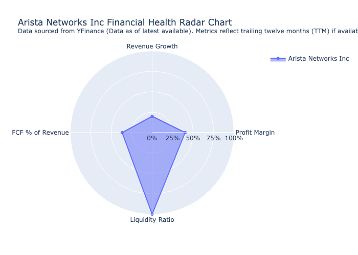

# Infera 📄

**Infera** pulls the signal from the noise , turning raw company data into clear, ranked intelligence. This intelligence can now be utilized to guide wise investment decisions.

---

## What Infera Does

- **Finds** real-time financials, leadership profiles, and market insights 📈
- **Synthesizes** the information into competitive summaries 🔍
- **Ranks** companies based on financial health, leadership strength, and market position 🏆
- **Visualizes** performance with interactive radar charts 📊
- **Outputs** a clean Markdown report ready for action 📄

---

## 🛠️ Core Tools and Technologies

| Tool | Purpose |
|:---|:---|
| **Python** | Core engine |
| **Yahoo Finance API** | Real-time financial data |
| **Wikipedia + Google Search** | Leadership profiling and company background |
| **LangGraph** | State-machine to sequence and manage tasks |
| **OpenAI (GPT-4)** | Summarization and ranking engine |
| **Plotly** | Radar chart visualization |

---

## What is the Purpose of Infera?

Deliver fast, deep, and actionable company intelligence
---

## ⚙️ How Infera Works — Under the Hood

Infera is built using a **LangGraph** state machine, where every node represents a clear, isolated function:

```plaintext
[user input] 
    ⬇
[Financial Data Extraction]
    ⬇
[Company Background Search]
    ⬇
[Executive Leadership Profiling]
    ⬇
[Detailed Report Generation]
    ⬇
[Summarization Engine]
    ⬇
[Ranking Engine]
    ⬇
[Output Report]
```

## 📄 Sample Full Company Analysis Report

See a full competitive analysis between **Uber** and **Lyft** generated by Infera:

[📂 View Sample Report (company_analysis_report.md)](company_analysis_report.md)

## 📊 Sample Financial Health Chart

Here's a real radar chart generated by Infera for **Arista Networks**:


