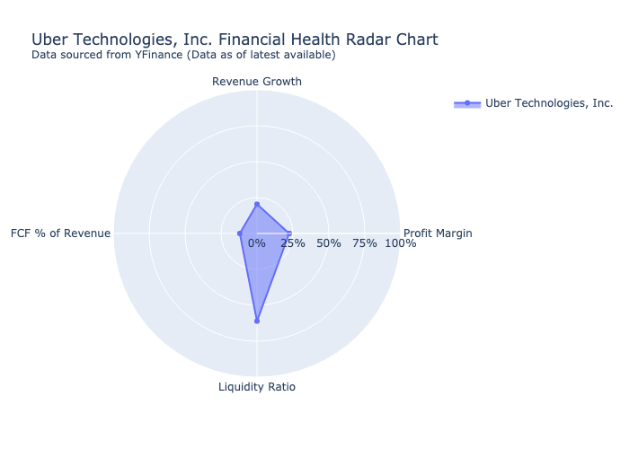
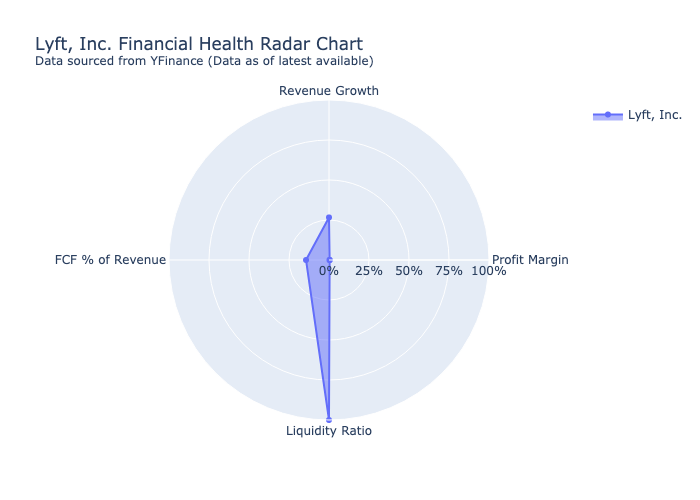

# Competitive Analysis Report

## Rankings

Based on overall performance, financial health, market position, and leadership, the rankings of the two companies are as follows:

1. **Uber Technologies, Inc.**
   - **Overall Performance**: Uber has a significantly larger market presence, with over 150 million monthly active users and 6 million active drivers. It operates globally in around 70 countries, averaging 28 million trips per day.
   - **Financial Health**: With a total revenue of $43.98 billion and a profit margin of 22%, Uber shows strong financial performance. The company's market capitalization of approximately $165.91 billion, along with a positive revenue growth rate of 20%, indicates robust financial health.
   - **Market Position**: As the largest ridesharing company in the world, Uber holds a dominant market position, which is further supported by its diverse service offerings in mobility, food delivery, and freight transport.
   - **Leadership**: Led by experienced executives, including CEO Dara Khosrowshahi, Uber benefits from strong leadership. However, the company faces ongoing legal challenges, which add complexity to its operations.

2. **Lyft, Inc.**
   - **Overall Performance**: Lyft is the second-largest ridesharing company in the U.S., but it has a more limited market presence compared to Uber, focusing primarily on the U.S. and Canada.
   - **Financial Health**: While Lyft reported a revenue growth rate of 27% and a free cash flow of $831.19 million, its profitability is concerning, with a profit margin of 0.00% and a much lower market capitalization of $5.61 billion compared to Uber.
   - **Market Position**: Lyft's position as the second-largest player in the U.S. ridesharing market is notable, but it still trails significantly behind Uber in terms of scale and revenue.
   - **Leadership**: The leadership team, including co-founders Logan Green and John Zimmer, has been instrumental in the company's development. However, the transition in CEO roles may raise concerns about stability and vision.

In summary, Uber ranks higher due to its dominant market position, stronger financial health, and experienced leadership, despite facing legal challenges. Lyft ranks lower primarily due to its limited market presence and lack of profitability.

## Uber Technologies, Inc. (UBER)

---

### Financial Health Radar Chart

### Business Summary

Uber Technologies, Inc. is an American multinational transportation company that provides ride-hailing services, courier services, food delivery, and freight transport. It is headquartered in San Francisco, California, and operates in approximately 70 countries and 10,500 cities worldwide. It is the largest ridesharing company worldwide with over 150 million monthly active users and 6 million active drivers and couriers. It coordinates an average of 28 million trips per day, and has coordinated 47 billion trips since its inception in 2010. In 2023, the company had a take rate (revenue as a percentage of gross bookings) of 28.7% for mobility services and 18.3% for food delivery.

### Financial Metrics

| Metric | Value |

|--------|-------|

| **Full Time Employees** | $31,100.00 |

| **Market Cap** | $165.91 Billion |

| **Total Revenue** | $43.98 Billion |

| **Quarterly Revenue** | $11.96 Billion |

| **Profit Margin** | $0.22 |

| **Free Cash Flow** | $5.27 Billion |

| **Day Low** | $78.87 |

| **Day High** | $80.35 |

| **Revenue Growth** | $0.20 |

| **Total Cash** | $6.98 Billion |

| **Total Debt** | $11.44 Billion |

### Executive Bios

**Ronald Sugar**

Ronald D. Sugar (born July 30, 1948) is an American business executive. He was the chairman of the board and chief executive officer of the Northrop Grumman Corporation from 2003 to 2009.

**Dara Khosrowshahi**

Dara Khosrowshahi (Persian: دارا خسروشاهی, Persian pronunciation: [dɑː'ɾɑːxosɾo'ʃɑːhiː]; born May 28, 1969) is an Iranian and American business executive who is the chief executive officer of Uber. He was previously CEO of Expedia Group, a company that owns several travel fare aggregators.

### Lawsuit Snapshot

Dec 4, 2024 ... Approval of the $200,000,000 Settlement was approved by the Honorable Richard Seeborg in the U.S. District Court for the Northern District of ...

Read more: https://www.labaton.com/cases/boston-retirement-system-v-uber-technologies-inc

## Lyft, Inc. (LYFT)

---

### Financial Health Radar Chart

### Business Summary

Lyft, Inc. is an American company offering ride-hailing services, motorized scooters, bicycle-sharing systems, and rental cars in the United States and select cities in Canada. Lyft sets fares, which vary using a dynamic pricing model based on local supply and demand at the time of the booking and are quoted to the customer in advance, and receives a commission from each booking. Lyft is the second-largest ridesharing company in the United States after Uber.

### Financial Metrics

| Metric | Value |

|--------|-------|

| **Full Time Employees** | N/A |

| **Market Cap** | $5.61 Billion |

| **Total Revenue** | $5.79 Billion |

| **Quarterly Revenue** | $1.55 Billion |

| **Profit Margin** | $0.00 |

| **Free Cash Flow** | $831.19 Million |

| **Day Low** | $13.05 |

| **Day High** | $13.54 |

| **Revenue Growth** | $0.27 |

| **Total Cash** | $1.98 Billion |

| **Total Debt** | $1.20 Billion |

### Executive Bios

**Logan Green (**

Logan D. Green is the chairman and former CEO of Lyft, which he co-founded with John Zimmer in 2012. Lyft grew out of Zimride, a rideshare company previously founded by the duo in 2007.

**John Zimmer (**

John Zimmer is the co-founder and former president of Lyft, an  on-demand transportation company, which he founded with Logan Green in 2012.
In March 2023, Zimmer announced that in June he would step down as Lyft president and become vice-chair of the board of directors.

**David Risher**

John David Risher (born July 15, 1965) is an American businessman and philanthropist. He is the CEO of Lyft, co-founder of Worldreader, a non-profit organization that aims to get children reading so they can reach their potential, and the co-founder of #HalfMyDAF whose goal is to inspire more philanthropic giving.

### Lawsuit Snapshot

remand for the trial court to apply the proper standard under RCW 42.56.540. BACKGROUND FACTS AND PROCEDURAL HISTORY. Respondents Lyft Inc. and Rasier LLC^ ...

Read more: https://www.courts.wa.gov/opinions/pdf/940266.pdf

